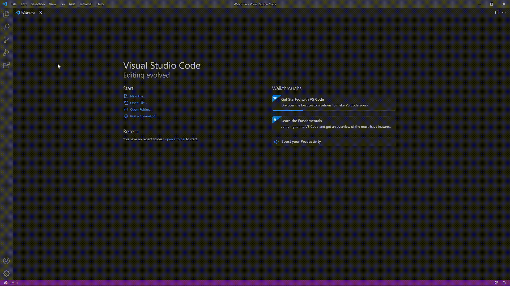
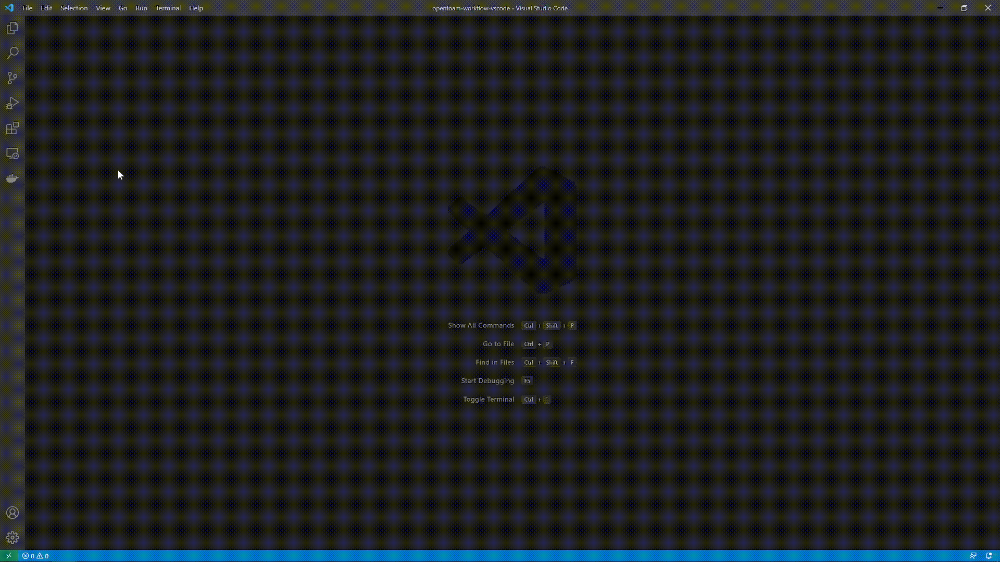

# Visual Studio Code workflow for OpenFOAM with Docker
Repository describing my favourite workflow combining Visual Studio Code, OpenFOAM and Docker 

## 1. Install Visual Studio Code
First, install the text editor [Visual Studio Code](https://code.visualstudio.com)

## 2. Install extensions
Install the following extensions, which will help our OpenFOAM workflow:
1. *Docker*
2. *Remote - Containers*
3. *OpenFOAM* (optional)

## 3. Associate OpenFOAM files for syntax highlighting (optional)
Next, we associate file types with OpenFOAM to get syntax highlighting.

## 4. Start a Docker container from Visual Studio Code

## 5. Attach the Docker container

## 6. Open a folder to access the file system
