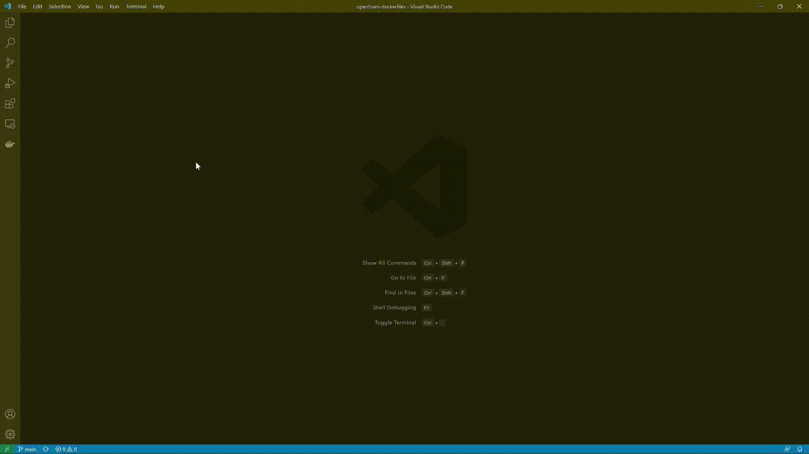
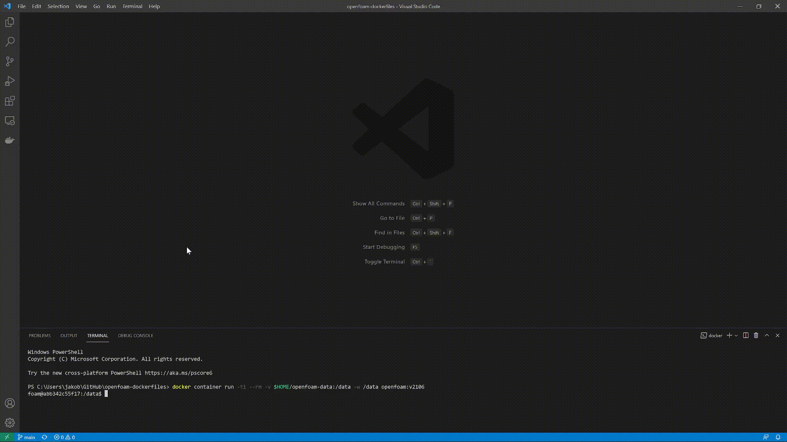
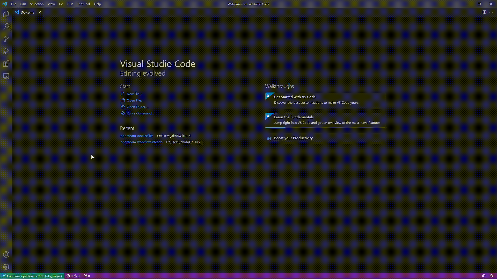

# Visual Studio Code workflow for OpenFOAM with Docker
Repository describing my favourite workflow combining Visual Studio Code, OpenFOAM and Docker. Make sure to first follow the guide at [https://github.com/jakobhaervig/openfoam-dockerfiles](https://github.com/jakobhaervig/openfoam-dockerfiles) before continuing with this guide.

## 1. Install Visual Studio Code
First, install the text editor [Visual Studio Code](https://code.visualstudio.com)

## 2. Install extensions
Install the following extensions, which will help our OpenFOAM workflow:
1. *Docker*
2. *Remote - Containers*
3. *OpenFOAM*


## 2. Associate OpenFOAM-specific files to enable syntax highlighting


## 3. Start Docker container
First, make sure Docker is running and you've build a Docker image container your OpenFOAM installation by following [github.com/jakobhaervig/openfoam-dockerfiles](https://github.com/jakobhaervig/openfoam-dockerfiles).

Next, start a terminal in VS Code and run the following command to start a Docker container:

```shell
docker container run -ti --rm -v $HOME/openfoam-data:/data -w /data openfoam:v2106

```



## 4. Attach Visual Studio Code to the running Docker container
Attach Visual Studio Code to the running Docker container. This enables us to access the file system within the container directly in VS Code.



## 5. Open a folder to access the file system
Finally, from within the newly opened window open a folder at root ``/`` to gain full access to the file system of the Docker container:



Now everything is set up and you are ready to do OpenFOAM simulations :-)