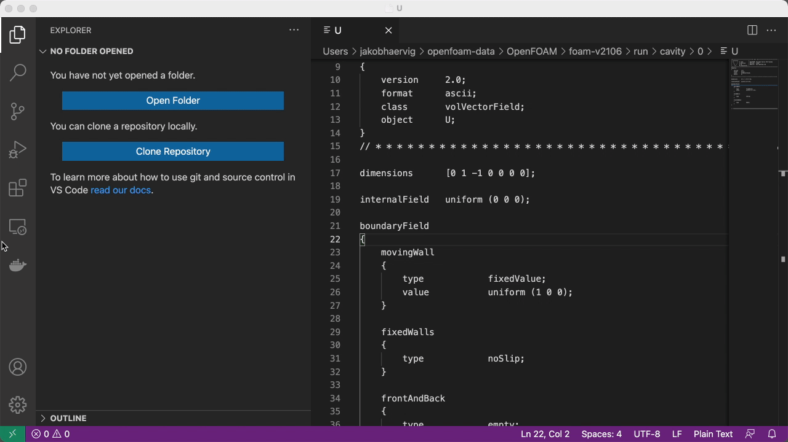

# openfoam-workflow
Repository describing the OpenFOAM, Docker, Visual Studio Code workflow

## 1. Installing extensions
Install the extensions *Docker*, *Remote - Containers* and *OpenFOAM*:

## 2. Associate OpenFOAM files for syntax highlighting:
